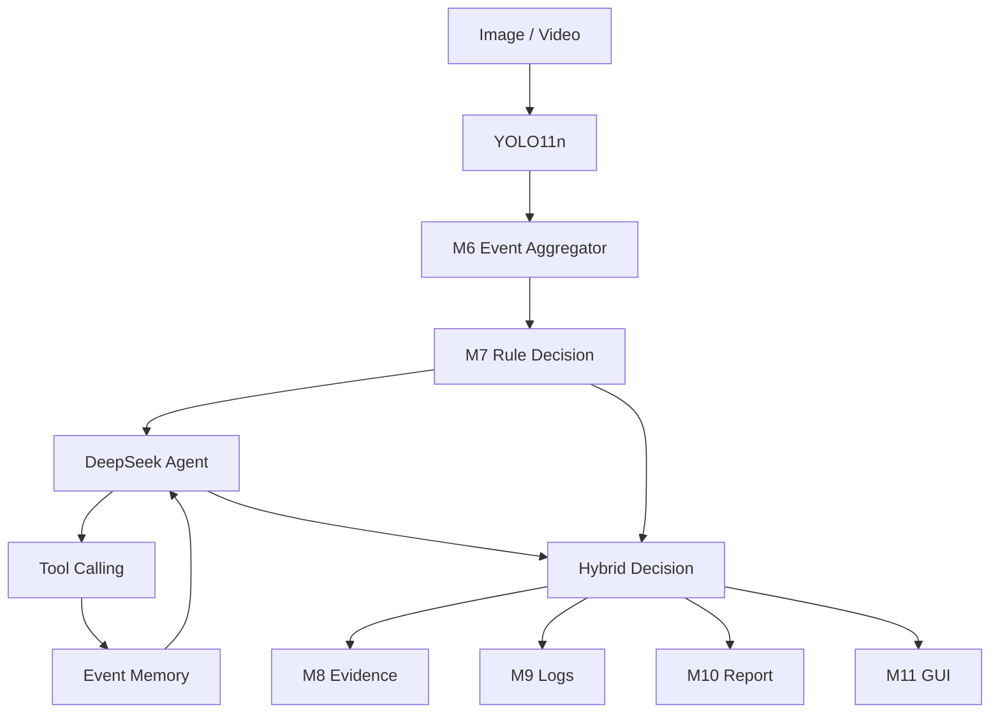
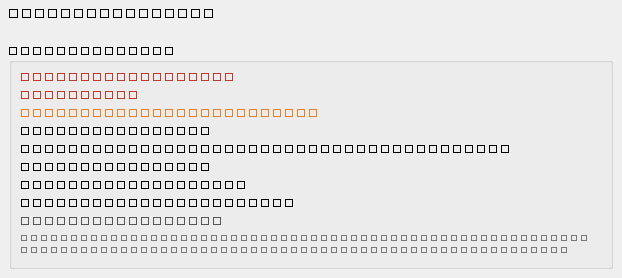
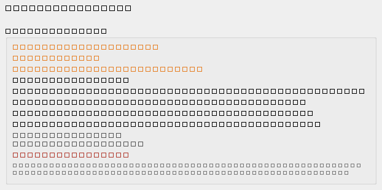
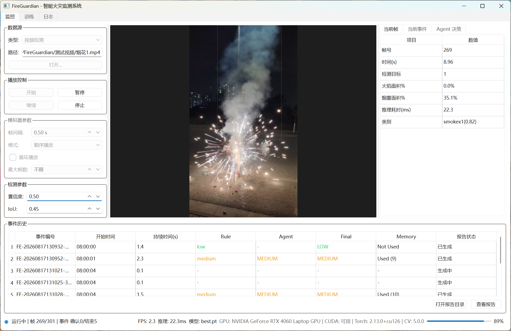
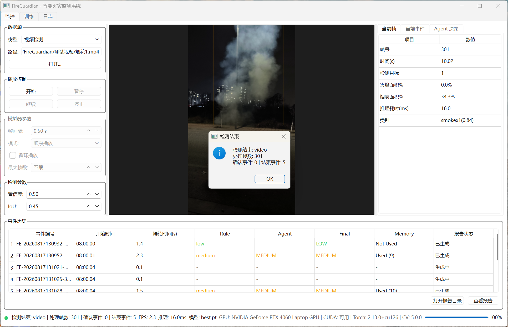
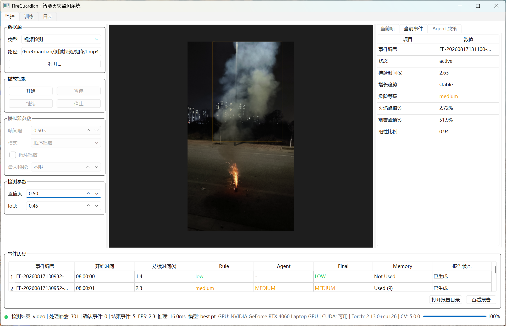
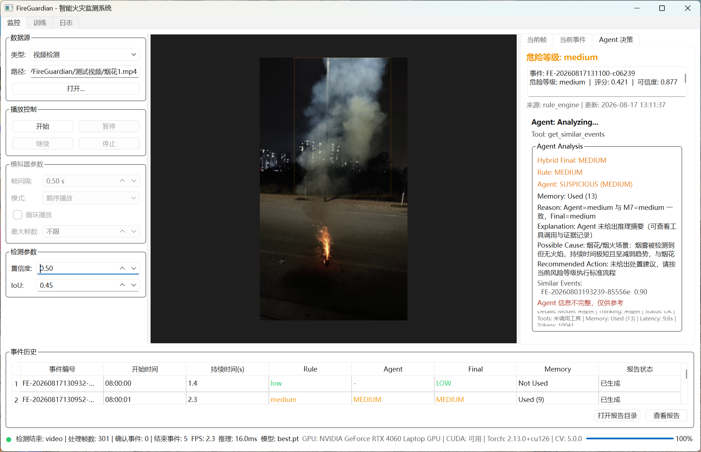
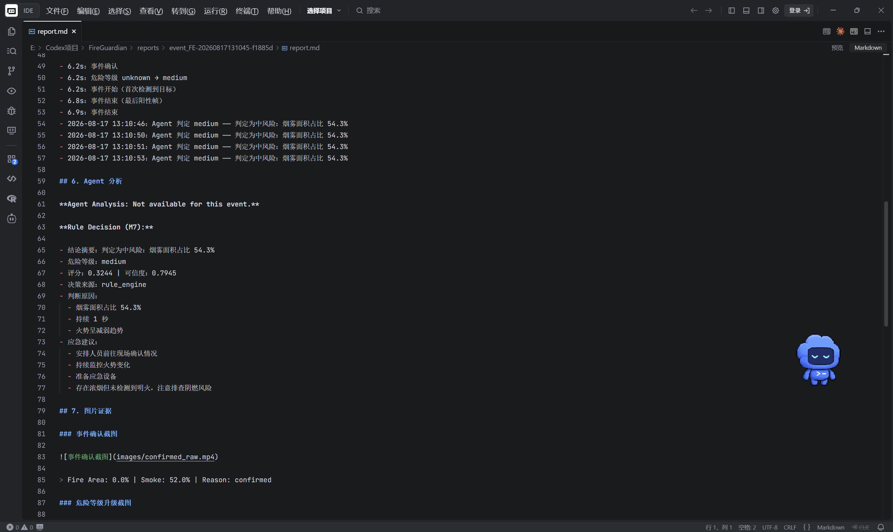

# FireGuardian

**基于 YOLO + DeepSeek Tool-Calling Agent 的智能火灾监控系统**

YOLO Detection · Rule Engine · DeepSeek Tool-Calling Agent · Agent Memory · Hybrid Decision · PyQt6 GUI

> Demo 状态：研究 / 求职项目 Demo（非生产安全认证系统）
> Current stable demo: `v0.2.0-agent`（V1 baseline: `v0.1.0-baseline`）

---

## 项目简介

FireGuardian 是一个火焰 / 烟雾检测与事件分析系统：YOLO11n 负责视觉感知，事件聚合与确定性规则引擎给出风险等级，DeepSeek Agent 在规则安全底座之上提供上下文解释、证据复核、历史记忆与处置建议，最后由 Hybrid Decision 进行安全融合。

为什么要做 V2：V1（YOLO + 规则）存在烟花 / 强光误检、规则缺乏上下文解释、没有历史经验的问题。V2 加入 LLM Agent 后，系统可以回答「为什么是这个等级」，并能利用历史相似事件辅助判断——但 M7 规则引擎始终作为确定性安全底座保留，LLM 不直接替代它。

> 本项目定位为研究 / 求职 Demo，不构成任何生产安全认证。

## 系统架构



M7 是确定性安全底座，Agent 是分析层，Hybrid 是最终融合层。

## 项目特色

### 特色一：Hybrid Decision

```text
M7 High
  ↓
Agent cannot downgrade
```

LLM 不直接替代规则引擎，而是在规则安全底座上提供解释、复核与历史分析；M7 High 永不被 Agent / Memory 降级。

### 特色二：Agent Memory

```text
Current Event
  ↓
Similar Historical Events
  ↓
Agent Analysis
```

使用结构化事件检索（只检索已结束历史事件）。当前版本没有使用 Embedding / Vector DB。

### 特色三：Fallback

```text
DeepSeek unavailable
or Invalid JSON
or Timeout
  ↓
Fallback to M7
```

Agent 失败不影响 YOLO → M6 → M7 基础链路，也不阻塞 GUI / 报告。

### 特色四：困难场景

烟花、强光、烟雾、真实火灾是 V2 的重点困难场景；V2 模型优化与 Agent 分析共同降低烟花 / 强光误检。

## 主要结果

| 指标 | 数值 |
| --- | --- |
| V1 Baseline mAP50 / mAP50-95 | 0.7352 / 0.4557（V1 测试集） |
| V2-15k mAP50（无泄漏 v2 测试集） | 0.7161 |
| 负样本图级误报率 conf=0.5（v2 测试集） | V1 2.61% → V2 0.84% |
| 自动化测试 | 186/186 通过 |

烟花 / 强光视频（本项目固定测试视频）fire 误检面积变化：

| 场景 | V1 | V2 | 结论 |
| --- | --- | --- | --- |
| me.mp4（烟花） | 0.140 | 0.009 | 下降约 15 倍 |
| 烟花1.mp4 | 0.104 | 0.022 | 下降约 4.6 倍 |
| 烟花2.mp4（强光） | 0.781 | 0.349 | 下降约 2.2 倍 |
| 烟火.mp4（真实火灾） | 0.519 | 0.521 | 保留，无明显损失 |

> 该对比来自本项目固定测试视频，不等价于对所有真实场景的泛化保证。

## Demo 案例

**Real Fire（真实火灾）**：YOLO → M6 → M7 → Agent → Hybrid，完整闭环演示 PASS。

**Fireworks（烟花 / 强光误检）**：V2 模型优化大幅降低 fire 误检，Agent 结合历史烟花模式给出 SUSPICIOUS 分析，Hybrid 保持 M7 High 不降级。





## 项目展示











## 测试

- Automated tests: **186/186 passed**（全部 Mock / 离线，不消耗真实 API）；
- Real API：DeepSeek Agent / Tool Calling / Memory / Hybrid 已通过真实 API 冒烟验证；
- GUI：人工验收通过；
- Final demo：PASS（真实视频完整闭环：YOLO → M6 → M7 → Agent → Hybrid → M8/M9/M10/M11）。

## 快速开始

### 1. 环境

Python 3.11（建议）

### 2. 安装依赖

```bash
python -m venv .venv
# Windows
.venv\Scripts\activate
# Linux / macOS
source .venv/bin/activate
pip install -r requirements.txt
```

### 3. 配置 DeepSeek API

```bash
copy .env.example .env      # Windows
cp .env.example .env        # Linux / macOS
```

在 `.env` 中填入你自己的 Key（需要自行到 DeepSeek 开放平台申请）：

```text
DEEPSEEK_API_KEY=
DEEPSEEK_BASE_URL=https://api.deepseek.com
DEEPSEEK_MODEL=deepseek-v4-flash
```

`.env` 已加入 `.gitignore`，不会进入仓库；请勿把 Key 写入 README / config / 源码。

### 4. 模型权重

模型权重不随仓库分发，请参见 [models/README.md](models/README.md)。未放置模型时，检测模块会因找不到权重文件而报错——放置 `models/best.pt` 即可运行。

### 5. 启动 GUI

```bash
python main.py
```

可使用自己的图片 / 视频作为输入；示例素材说明见 [examples/README.md](examples/README.md)。

## 目录结构

```text
agent/        DeepSeek Agent / Hybrid / Memory / Presentation
aggregator/   M6 Event Aggregation
detect/       M3 图片检测
video_detect/ M4 视频检测
simulator/    M5 模拟验证流
reports/      M10 Report
ui/           M11 GUI
train/        YOLO Training
tools/        Audit / Evaluation / Demo / 报告
tests/        Unit / Integration Tests（fixtures 在 tests/fixtures）
docs/         文档与研发技术总结报告
config/       配置文件（config.yaml / llm_agent.yaml）
```

## My Contributions

- 搭建 YOLO fire/smoke 检测与事件聚合链路；
- 设计 M7 确定性风险规则；
- 解决 bbox 重叠面积重复计算和 frame/seconds 时间语义问题；
- 完成数据集审计、去重与 Baseline 训练评估；
- 接入 DeepSeek Tool-Calling Agent；
- 设计 Hybrid Decision 与 M7 High 安全保护；
- 实现结构化 Agent Memory；
- 将 Agent 接入 M10 / M11；
- 构建困难负样本并完成 V2 模型优化；
- 完成 Agent + YOLO 联合测试和最终闭环演示。

## 限制说明

- 原始数据集不随仓库提供；
- 模型权重不随仓库提供；
- DeepSeek API Key 需要自行配置；
- Memory 当前为结构化检索（无 Embedding / Vector DB）；
- 当前模型仍可能在困难强光场景产生误检；
- Agent 存在秒级延迟（单事件约 4.5k~8.8k tokens / 7~18s）；
- 项目定位为研究 / 求职 Demo，而非生产安全认证系统。

## 版本

- `v0.1.0-baseline`：V1 稳定基线（YOLO + M6~M11）；
- `v0.2.0-agent`：V2 Agent Stable Demo（DeepSeek Agent + Memory + Hybrid + M10/M11 + V2 模型）。

## 文档

- [完整研发技术总结报告](docs/FireGuardian_V2_研发技术总结报告.md)
- [架构说明](docs/architecture.md)
- [研发历史](docs/development_history.md)
- [部署说明](docs/deployment.md)
- [测试说明](docs/testing.md)

## License

本项目原创代码版权归项目作者所有，并以 CC BY-NC 4.0（非商业）许可授权。项目依赖的第三方开源组件分别遵循其各自许可证，相关依赖及许可证信息见 `requirements.txt`。

> 本项目仅用于学习与研究，不得用于任何商业用途。
